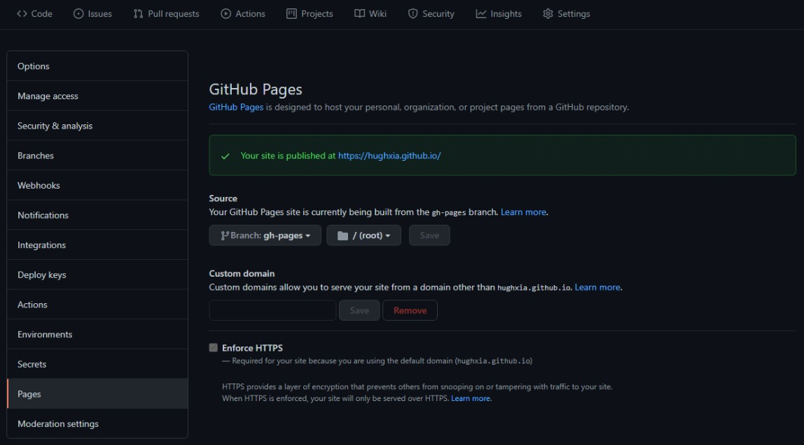

## 前言

本文会介绍如何基于 Github Pages + Github Actions + Hugo 搭建个人博客网站，它主要包括以下特性：

- 免费托管
- 版本控制
- 全自动部署
- Markdown语法支持
- 个性化主题
- 支持自定义域名

### 前置知识

- [Git](https://git-scm.com)（熟悉）
- [GitHub](https://github.com)（了解）
- Markdown（了解）
- HTML&CSS（了解）

### 必备条件

- Github 账户

效果展示：[https://hughxia.github.io](https://hughxia.github.io/)

项目地址：[https://github.com/hughxia/hughxia.github.io](https://github.com/hughxia/hughxia.github.io)

## 创建 GitHub Pages 站点

> [Github Pages](https://pages.github.com/) 适用于具有 GitHub Free 和组织的 GitHub Free 的公共仓库，以及具有 GitHub Pro、GitHub Team、GitHub Enterprise Cloud 和 GitHub Enterprise Server 的公共和私有仓库。

Github Pages 可以帮助我们从特定的 GitHub Repo 生成静态站点。这里我们参照[Github Pages 官方文档](https://docs.github.com/cn/pages/getting-started-with-github-pages/creating-a-github-pages-site)创建属于你的个人站点。

### 创建仓库

首先新建一个 Repository，Repository name 根据 Owner 的不同，名字要求分别为 `<user>.github.io` 或 `<organization>.github.io` 格式。因为是个人博客，我们使用自己的用户名。

### 查看设置

当创建完成后，就可以在 Github Repository 页中看到刚刚创建的 `<user>.github.io` ，我们可以在此 Repo 上方的 **Settings** 菜单中的 *Pages* 页，进行相关设置。


在 *Source* 项中可以配置站点的发布源，默认应为 `main` 分支的根目录。图中我设置为了 `gh-pages` 分支，原因后面再讲。

在 *Custom domain* 项则可以配置自定义域名，并启用HTTPS。

## 使用 Hugo 生成博客框架

> [Hugo](https://gohugo.io/) is one of the most popular open-source static site generators. With its amazing speed and flexibility, Hugo makes building websites fun again.

要搭建完整的 Blog 还需要*博客生成器*的帮助。目前主流的三大工具分别为[Hugo](https://github.com/gohugoio/hugo)，[Jekyll](https://github.com/jekyll/jekyll)和[Hexo](https://github.com/hexojs/hexo)。其中Hugo的 🌟 最多，编译速度也最快，这里我们选用它来做示例。

### 安装Hugo

MacOS 和 Linux 系统都可以直接在命令行进行安装，Windows 系统的安装可以参照[官方文档](https://gohugo.io/getting-started/installing)。这里以 Ubuntu20.04 为例，打开终端，输入安装命令：

``` Shell
apt install hugo
```

安装完成后，通过以下命令进行确认：

``` Shell
hugo version
```

### 新建站点

进入上面创建的 `<user>.github.io` 项目路径，执行下面的命令，Hugo会在当前路径创建站点框架。默认配置文件格式为 `TOML` 格式，可以通过 `-f yaml` 参数修改为我们熟悉的 `YAML` 格式。

``` Shell
hugo new site . -f yaml
```

### 选择主题

[官方主题页](https://themes.gohugo.io/)有丰富的主题可供选择，下面以我目前使用的 [hugo-theme-stack](https://themes.gohugo.io/themes/hugo-theme-stack/) 为例。

这里我们可以通过 [Git Submodule](https://git-scm.com/book/en/v2/Git-Tools-Submodules) 机制将主题仓库克隆下来：

``` Shell
git submodule add https://github.com/htdvisser/hugo-theme-stack.git themes/hugo-theme-stack
```

**注意：** 当我们使用 `git clone` 命令拉取远程仓库的时候，默认不会拉取子模块代码，可以通过添加 `--recurse-submodules` 参数来拉取。 或者在主项目中执行以下命令：

``` Shell
git submodule update --remote --merge 
```

### 编辑配置

在项目根目录下可以找到 `config.yaml` 文件，这是整个Hugo项目的配置文件，我们修改 `baseurl` , `languageCode` ,  `title` 和 `theme` 这几个字段完成基本配置。主题往往都会提供丰富的自定义配置，可以自行查阅项目文档。

``` Yaml
baseurl: https://hughxia.github.io/
languageCode: zh-cn
theme: hugo-theme-stack
title: Hugh's Blog
```

### 创建文章

执行以下命令创建一篇文章：

``` Shell
hugo new post/first-post.md
```

Hugo会在 Markdown 文件头部以配置文件相同语法的形式添加一些 Meta 信息，我们在分隔线 `---` 下方进行文章内容的编辑。

### 本地预览

启动 `hugo server`，即可在本地[http://localhost:1313](http://localhost:1313)进行预览。

``` Shell
hugo server -D
```

其中 `-D` 参数指会渲染草稿，通过 `hugo new posts` 命令创建出来的文章顶部Meta信息中默认**draft**设置为 *true* ，当编辑完成准备正式发布时，需要将其改为 *false*。

## 通过 Github Actions 自动部署

> 在 [GitHub Actions](https://docs.github.com/cn/actions) 的仓库中自动化、自定义和执行软件开发工作流程。 您可以发现、创建和共享操作以执行您喜欢的任何作业（包括 CI/CD），并将操作合并到完全自定义的工作流程中。

### 部署问题

现在可以通过 `hugo` 命令在 **public** 文件夹下生成最终页面。我们可以将这个文件夹也加入到Git的版本控制，然后通过在上述 **Settings** 页中将发布源改为 **public** 来完成部署。

不过，这需要我们每次在完成文章创作，同步至 Github 之前都需要主动生成 **public** 文件夹，这样不仅麻烦而且会在我们当前的仓库中增加很多冗余文件。好在 Github 官方推出了 CI 利器：Github Actions，通过它可以完美地解决上述问题。

### 基本概念

- **工作流程**（workflow）: 工作流程是您添加到仓库的自动化过程。
- **事件**（event）: 事件是触发工作流程的特定活动。
- **作业**（job）: 作业是在同一运行服务器上执行的一组步骤。
- **步骤**（step）: 步骤是可以在作业中运行命令的单个任务。
- **操作**（action）: 操作是独立命令，它们组合到步骤以创建作业。

### CI配置

在 Github 的 Repo 页上方我们可以看到 **Actions** 菜单，在这里我们可以方便地创建一个 `Workflow` ，下面是我的配置：

```Yaml
name: CI

# Controls when the workflow will run
on:
  # Triggers the workflow on push or pull request events but only for the main branch
  push:
    branches: [main]
  pull_request:
    branches: [main]

  # Allows you to run this workflow manually from the Actions tab
  workflow_dispatch:

# A workflow run is made up of one or more jobs that can run sequentially or in parallel
jobs:
  # This workflow contains a single job called "build"
  deploy:
    # The type of runner that the job will run on
    runs-on: ubuntu-latest

    # Steps represent a sequence of tasks that will be executed as part of the job
    steps:
      - name: Git checkout
        uses: actions/checkout@v2
        with:
          submodules: true # Fetch Hugo themes (true OR recursive)
          fetch-depth: 0 # Fetch all history for .GitInfo and .Lastmod

      - name: Setup Hugo
        # You may pin to the exact commit or the version.
        # uses: peaceiris/actions-hugo@2e89aa66d0093e4cd14751b3028fc1a179452c2e
        uses: peaceiris/actions-hugo@v2.4.13
        with:
          hugo-version: "0.84.4"

      # Runs a single command using the runners shell
      - name: Build
        run: hugo --minify

      - name: Deploy
        uses: peaceiris/actions-gh-pages@v3
        if: github.ref == 'refs/heads/main'
        with:
          github_token: ${{ secrets.GITHUB_TOKEN }}
          publish_dir: ./public
```

上述配置的意思是我们会在每次 `push` 代码至 `main` 分支的时，在最新的 Ubuntu 系统环境下依次完成以下操作：

1. 将 `main` 分支最新代码检出

2. 安装指定版本的 `hugo`

3. 通过 `hugo --minify` 以最小化的方式打包网页至 **public** 文件

4. 将打包后的文件夹推送至当前仓库的  `gh-pages` 分支

还记得上面在 *Pages* 图片中的配置吧，这时候 Github Pages 就会从 `gh-pages` 分支的根目录生成最终的网页。可以在 **Actions** 页查看 *Job* 的执行情况。当执行完成后，一般等待 1 ~ 3 分钟，就可以在自己的博客网站看到最新提交的内容了。

## 后记

通过上面的步骤，我们完成了一个属于你自己的博客网站的搭建（别忘了定制你的个性化主题哟~），接下来就随心所欲地开始你的内容创作吧。
