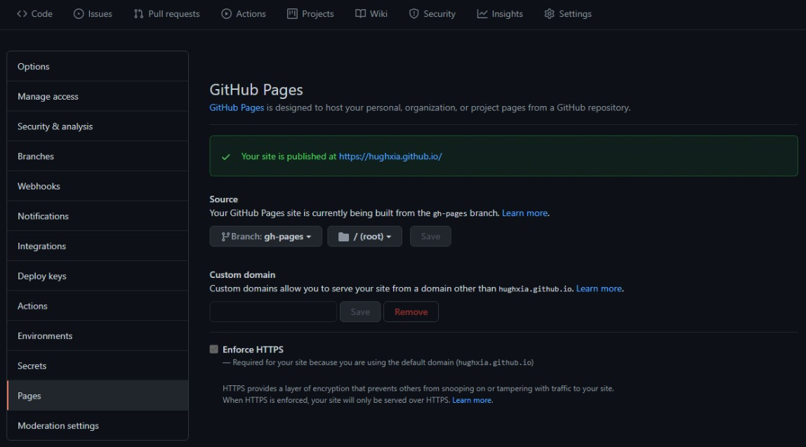

## 前言

本文会介绍如何基于Github Pages + Github Actions + Hugo搭建个人博客，搭建完成后你只需要完全专注于文章创作，其余事情完全不用操心。它主要包括以下特性：

- 免费托管
- 版本控制
- 全自动部署
- Markdown语法支持
- 个性化主题
- 支持绑定自定义域名
- 丰富的拓展性

### 前置知识

- [Git](https://git-scm.com)（熟悉）
- [GitHub](https://github.com)（了解）
- Markdown（了解）
- HTML&CSS（了解）

效果展示：[https://hughxia.github.io](https://hughxia.github.io/)

项目地址：[https://github.com/hughxia/hughxia.github.io](https://github.com/hughxia/hughxia.github.io)

## 创建GitHub Pages站点

> [Github Pages](https://pages.github.com/) is available in public repositories with GitHub Free and GitHub Free for organizations, and in public and private repositories with GitHub Pro, GitHub Team, GitHub Enterprise Cloud, and GitHub Enterprise Server.

Github Pages 可以帮助我们从特定的GitHub Repo生成静态站点。这里我们参照[Github Pages 官方文档](https://docs.github.com/cn/pages/getting-started-with-github-pages/creating-a-github-pages-site)创建属于你的个人站点。

### 1. 创建仓库

首先新建一个Repository，Repository name 根据 Owner的不同，名字要求分别为`<user>.github.io` 或 `<organization>.github.io`格式。因为是个人博客，我们使用自己的用户名。

### 2. 查看设置

当创建完成后，就可以在Github Repository中看到刚刚创建的 `<user>.github.io` 项目，我们可以在当前Repo的 **Setting**菜单中的*Pages*页，进行相关设置。


在*Source*项中可以配置站点的发布源，默认应为`main`分支的根目录。图中我设置为了`gh-pages`分支，原因后面再讲。

在*Custom domain*项则可以配置自定义域名，并使用HTTPS。

## 使用Hugo生成博客框架

> [Hugo](https://gohugo.io/) is one of the most popular open-source static site generators. With its amazing speed and flexibility, Hugo makes building websites fun again.

目前我们的个人站点只有一个简单的静态页面，要搭建完整的Blog系统还需要*博客生成器*的帮助。目前主流的三大工具分别为[Hugo](https://github.com/gohugoio/hugo)，[Jekyll](https://github.com/jekyll/jekyll)和[Hexo](https://github.com/hexojs/hexo)。其中Hugo的Star数最多，编译速度也最快，这里我们选用它来做示例。

### 1. 安装Hugo

MacOS和Linux系统都可以直接在命令行进行安装，Windows系统的安装可以参照[官方文档](https://gohugo.io/getting-started/installing)。这里以Ubuntu20.04为例，打开终端，输入安装命令：

``` Shell
apt install hugo
```

安装完成后，通过以下命令进行确认：

``` Shell
hugo version
```

### 2. 新建站点

进入上面创建的 `<user>.github.io` 项目路径，执行下面的命令，Hugo会在当前路径创建站点框架。

``` Shell
hugo new site .
```

### 3. 选择主题

[官方主题页](https://themes.gohugo.io/)有丰富的主题可供选择，下面以我选择的[Base16](https://themes.gohugo.io/themes/hugo-base16-theme/)为例讲解。

这里我们可以通过[Git Submodule](https://git-scm.com/book/en/v2/Git-Tools-Submodules)机制将主题仓库克隆下来：

``` Shell
git submodule add https://github.com/htdvisser/hugo-base16-theme.git themes/base16
```

**注意：** 当我们使用`git clone`命令拉取远程仓库的时候，默认不会拉取子模块代码，可以通过添加`--recurse-submodules`参数来拉取。 或者在主项目中执行以下命令：

``` Shell
git submodule update --remote --merge 
```

### 4. 编辑配置

在项目主目录下可以找到`config.toml`文件，这是整个Hugo项目的配置文件，我们修改`baseURL`, `title`和`theme`这几个字段完成基本配置。其中不同的主题会提供丰富的自定义配置，可以参考主题的*homepage*按需配置。示例：

``` Toml
baseURL = "https://hughxia.github.io/"
languageCode = "en-us"
title = "Hugh's Blog"
theme = "base16"
```

### 5. 创建文章

在主目录下执行以下命令创建一篇文章：

``` Shell
hugo new post/first-post.md
```

Hugo会帮我们在md文件头部以toml语法的形式添加一些Meta信息，我们在`---`下方进行文章内容的编辑。

### 6. 本地预览

启动hugo server，即可在本地[http://localhost:1313](http://localhost:1313)进行预览。

``` Shell
hugo server -D
```

其中 `-D` 参数指会渲染草稿，通过 `hugo new posts`命令创建出来的文章顶部Meta信息中默认**draft**设置为*true*,当编辑完成准备正式发布时，需要将其改为*false*。

## 通过Github Actions完成自动部署工作

TODO
